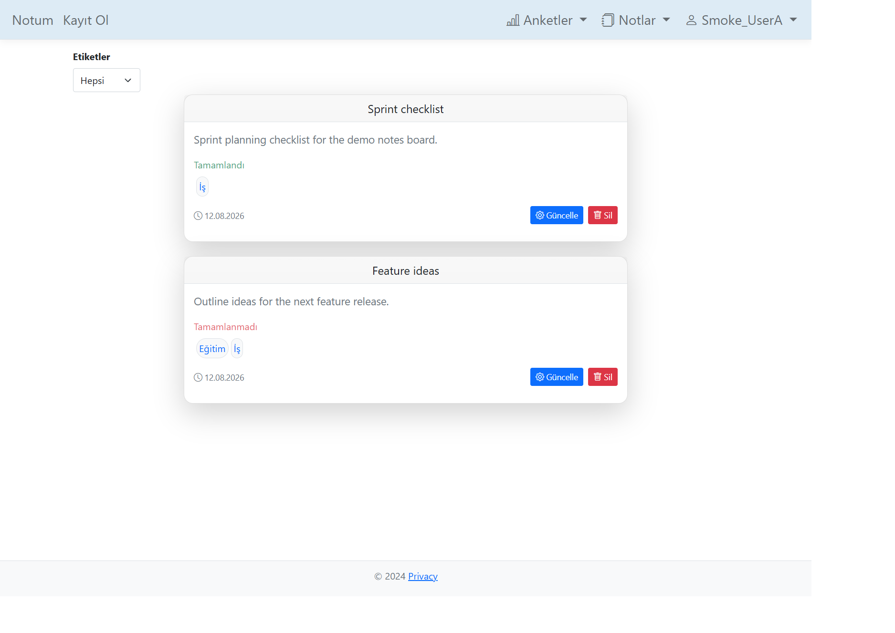
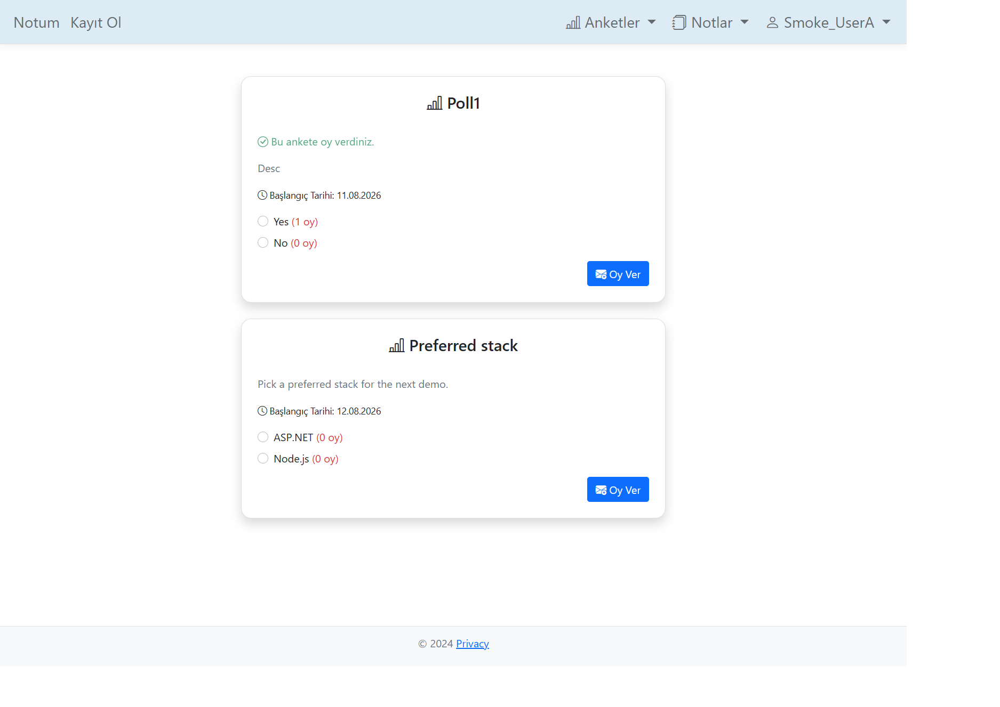
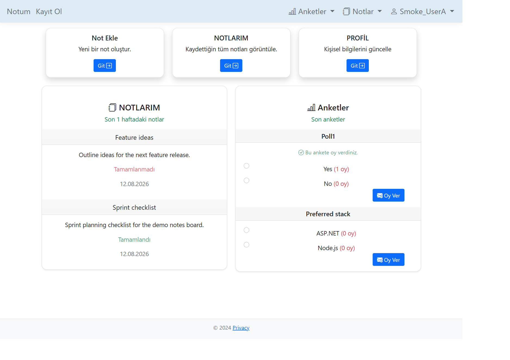
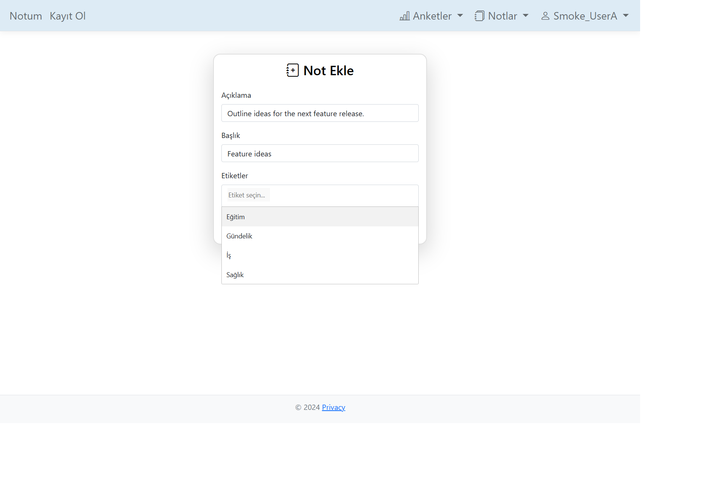

# AppNot

ASP.NET Core MVC note-taking and polling web app with authentication, tags, and user-specific CRUD.

Built with **ASP.NET Core Identity**, **Entity Framework Core**, and **SQL Server**.

## Features

- User registration, login, and logout (ASP.NET Core Identity)
- Password change
- Notes CRUD (create, list, update, delete)
- Note completion status
- Tag-based note organization and filtering
- Poll creation with multiple options
- Poll voting with live vote counts
- One vote per user per poll
- Per-user note ownership checks on update/delete

## Tech Stack

- ASP.NET Core 8 MVC
- C#
- Entity Framework Core
- SQL Server
- ASP.NET Core Identity
- Razor Views
- Repository Pattern
- Dependency Injection
- LINQ
- Bootstrap 5
- jQuery
- Choices.js

## Architecture

```text
Controller
  → Repository interfaces (DI)
    → EF Core / IdentityDbContext
      → SQL Server
```

Domain data access goes through repository interfaces (`INotRepository`, `ITagRepository`, `IAnketRepository`, `IUserVoteRepository`) implemented with EF Core. Identity is handled by ASP.NET Core Identity on top of the same `IdentityDbContext`.

## Security

- Authenticated routes for notes, polls, and account actions
- Public access only for Home, login, and registration
- Per-user note ownership validation on update/delete
- Anti-forgery tokens on state-changing forms
- ASP.NET Core Identity for authentication

## Screenshots

### Notes & Tag Filtering



### Polls & Voting



### Dashboard



### Create Note



## Configuration

Real connection strings are **not** stored in the repository.

1. Copy the example config to a local Development file (gitignored):

**PowerShell**

```powershell
Copy-Item NotUyg\appsettings.example.json NotUyg\appsettings.Development.json
```

**bash**

```bash
cp NotUyg/appsettings.example.json NotUyg/appsettings.Development.json
```

2. Edit `NotUyg/appsettings.Development.json` and set your own SQL Server connection string under `ConnectionStrings:sql_connection`.

Example placeholder (replace with your server):

```json
"ConnectionStrings": {
  "sql_connection": "Server=YOUR_SERVER\\SQLEXPRESS;Database=NotUygDb;Trusted_Connection=True;TrustServerCertificate=True;MultipleActiveResultSets=true"
}
```

## Running Locally

Requirements:

- [.NET 8 SDK](https://dotnet.microsoft.com/download)
- SQL Server (Express or LocalDB)
- EF Core tools: `dotnet tool install --global dotnet-ef`

Steps:

```bash
git clone https://github.com/enessoydan33/AppNot.git
cd AppNot
```

Create and edit Development config (see Configuration above), then:

```bash
cd NotUyg
dotnet restore
dotnet ef database update
dotnet run
```

Open the URL shown in the console (typically `https://localhost:7139` or `http://localhost:5030`).

## Database / Data Model

- `User` → many `Not` (notes)
- `Not` ↔ `Tag` (many-to-many)
- `Poll` → many `Option`
- `UserVote` links `User`, `Poll`, and `Option` (one vote per user per poll)

## Project structure

```text
AppNot/
├── NotUyg/
│   ├── Controllers/
│   ├── Data/             # DbContext and repositories
│   ├── Entity/
│   ├── Migrations/
│   ├── Models/
│   ├── Views/
│   └── wwwroot/
├── docs/screenshots/
└── README.md
```
